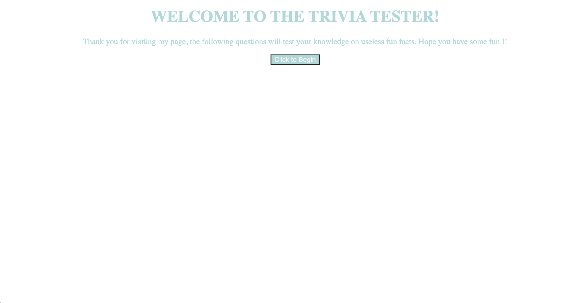

# timedQuiz

## Description

The goal of this project was to create a fun trivia based quiz for users to enjoy. The project has a clock that counts down and time is subtracted off for each wrong answer to add to the thrill. This is a great concept which drills local storage and use of javascript functions and arrays.

## Table of Contents (Optional)

If your README is long, add a table of contents to make it easy for users to find what they need.

- [Installation](#installation)
- [Usage](#usage)
- [Credits](#credits)

## Installation

This code was created from scratch and is available to be accessed via github and the links below:

https://github.com/kgiunta/timedQuiz
https://kgiunta.github.io/timedQuiz/

## Usage

Below is a screenshot of the start page:

## Credits

Julian Robertson | https://github.com/julianr3 
Issak Morales | https://github.com/CallMeIce 
Dominick Albano | https://github.com/dev-dominick 
Jehyun Jung | Penn LPS Tutor
